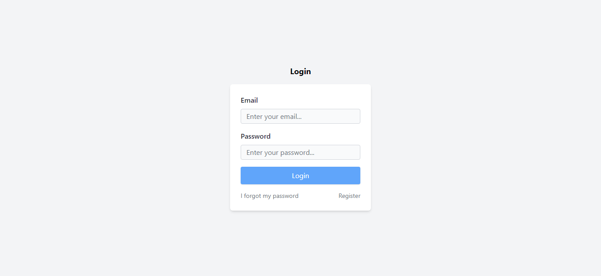

<h1 align='center'>Login Page using TailwindCSS</h1>

<p align="center">
  <a href="#-sobre">Sobre</a>&nbsp;&nbsp;&nbsp;|&nbsp;&nbsp;&nbsp;
  <a href="#-layout">Layout</a>&nbsp;&nbsp;&nbsp;|&nbsp;&nbsp;&nbsp;
  <a href="#-tecnologias-e-ferramentas">Tecnologias e Ferramentas</a>&nbsp;&nbsp;&nbsp;|&nbsp;&nbsp;&nbsp;
  <a href="#-como-usar">Como usar</a>&nbsp;&nbsp;&nbsp;|&nbsp;&nbsp;&nbsp;
  <a href="#-licença">Licença</a>&nbsp;&nbsp;&nbsp;|&nbsp;&nbsp;&nbsp;
</p>

<p align="center">
    ✔ Projeto concluído
</p>

<hr/>


## ❓ Sobre

Este projeto é uma página de login simples feita usando HTML e TailwindCSS. 
A página foi desenvolvida durante um curso do canal [Tiago Matos](https://www.youtube.com/watch?v=1eLaBow7Zbo&list=PLcoYAcR89n-r1m-tMfV4qndrRWpT_rb9u). 


## 🎨 Layout




## 🛠 Tecnologias e Ferramentas

- [HTML](https://developer.mozilla.org/pt-BR/docs/Web/HTML)
- [TailwindCSS (CLI)](https://tailwindcss.com/docs/installation)
- [VsCode](https://code.visualstudio.com/)


## 💻 Como usar

Antes de continuar, é recomendado possuir alguns conhecimentos básicos de [HTML5](https://developer.mozilla.org/pt-BR/docs/Web/HTML), [CSS3](https://developer.mozilla.org/pt-BR/docs/Web/HTML) e [JavaScript](https://www.javascript.com/) e
além disso, você precisa ter instalado em sua máquina o [GIT](https://git-scm.com/), [Node](https://nodejs.org/en) e um **editor de texto** de sua preferência. Recomendo sempre o [Visual Studio Code](https://code.visualstudio.com/). 

Um guia básico sobre como instalar e executar o projeto na sua máquina local: 

1. Clone o projeto ou faça download do ZIP: 

```bash
    # abra o terminal (Git bash) e digite 
    # não precisa fazer isso se já tiver feito download do projeto (nesse caso, só extraia a pasta e entre nela)
    $ git clone https://github.com/Gustavo-Victor/login-page-tailwindcss.git
```

2. Entre na pasta do projeto:

```bash
    $ cd login-page-tailwindcss/
```

3. Instale as dependências:

```bash
    $ npm install yarn -g ;  
    $ yarn ; 
```

4. Execute a aplicação:

```bash
    $ yarn dev
```

5. Abra o projeto no seu navegador de preferência

- Abra o arquivo ./src/index.html em qualquer navegador web
- Qualquer edição de estilo por padrão é feita no arquivo ./src/input.css

<hr/>


## 📝 Licença 

O projeto está sob a **Licensa MIT** 

Qualquer pessoa pode usar, clonar e contribuir com este projeto. 

Clique [aqui](./LICENSE) para saber mais  


